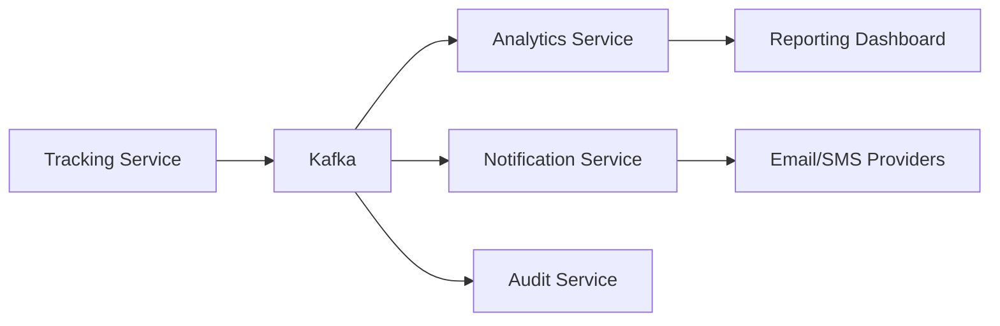
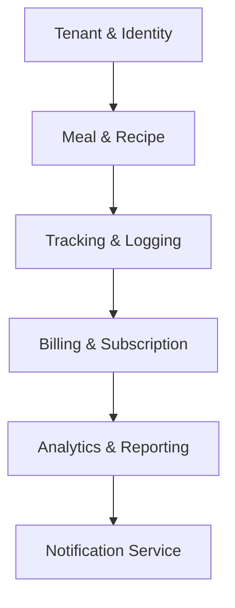

# 🥗 NutraTenant

<div align="center">


### Enterprise Multi-Tenant Nutrition Platform

*A scalable, event-driven SaaS platform for nutrition tracking, meal planning, wellness management, and organizational health analytics.*

</div>

---

## 📖 Overview

**NutraTenant** is a cloud-native, multi-tenant nutrition and meal-tracking platform designed for:

- 🏋️ Fitness organizations
- 🏢 Corporate wellness programs
- 🏥 Healthcare providers
- 🥗 Nutrition coaching businesses
- 🌍 Enterprise wellness ecosystems

Built on a microservices architecture, NutraTenant provides:

- Complete tenant isolation
- White-label customization
- High-throughput food logging
- Real-time analytics
- Enterprise-grade security
- Subscription and billing management

---

## ✨ Core Capabilities

### 🔒 Multi-Tenant Isolation

Each tenant operates within a secure and isolated environment.

**Supported Isolation Models**

| Model | Use Case |
|---------|---------|
| Schema-per-Tenant | Strong isolation with shared infrastructure |
| Database-per-Tenant | Enterprise-grade isolation |
| Shared Database + Tenant Context | Cost-efficient deployments |

**Key Features**

- Tenant-aware request routing
- Automated provisioning
- Tenant-specific configurations
- Data leak prevention mechanisms
- Compliance-ready architecture

---

### 🎨 White-Label Platform

Allow every organization to fully customize their experience.

**Customization Options**

- Custom domains and subdomains
- Brand logos
- Color themes
- Email templates
- SMS branding
- Regional settings
- Measurement systems (Metric / Imperial)

---

### ⚡ High-Performance Tracking

Built for extremely high write volumes.

**Supported Tracking**

- Food consumption
- Water intake
- Custom nutrients
- Daily calories
- Macros and micros
- Meal schedules

**Performance Goals**

| Metric | Target |
|----------|---------|
| API Response Time | < 100ms |
| Tracking Throughput | 10K+ events/sec |
| Analytics Processing | Near real-time |
| Availability | 99.9%+ |

---

### 📊 Event-Driven Analytics

Analytics workloads are completely separated from transactional workloads.

Benefits include:

- Real-time dashboards
- Historical trend analysis
- Behavioral insights
- Organizational reporting
- Compliance reporting
- Export pipelines

---

## 🏗️ Architecture

```text
                            ┌─────────────────────┐
                            │     API Gateway     │
                            │   Kong / Envoy      │
                            └──────────┬──────────┘
                                       │
             ┌─────────────────────────┼─────────────────────────┐
             │                         │                         │
             ▼                         ▼                         ▼

   ┌─────────────────┐     ┌─────────────────┐     ┌─────────────────┐
   │ Tenant Identity │     │ Meal Catalog    │     │ Tracking Service│
   └─────────────────┘     └─────────────────┘     └─────────────────┘
             │                         │                         │
             └──────────────┬──────────┴──────────┬──────────────┘
                            ▼                     ▼

                   ┌─────────────────┐   ┌─────────────────┐
                   │ Kafka/RabbitMQ  │   │ Redis Cache     │
                   └────────┬────────┘   └─────────────────┘
                            │
          ┌─────────────────┼─────────────────┐
          ▼                                   ▼

 ┌─────────────────┐               ┌─────────────────┐
 │ Analytics       │               │ Notification    │
 │ Service         │               │ Service         │
 └─────────────────┘               └─────────────────┘
```

---

## 🛠 Technology Stack

| Layer | Technology |
|---------|---------|
| API Gateway | Kong Gateway, Envoy |
| Backend Services | Go, NestJS, Python |
| Databases | PostgreSQL |
| Cache Layer | Redis |
| Messaging | Kafka, RabbitMQ |
| Containerization | Docker |
| Orchestration | Kubernetes |
| CI/CD | GitHub Actions / Azure DevOps |
| Monitoring | Prometheus, Grafana |
| Logging | Loki, ELK Stack |
| Tracing | OpenTelemetry |

---

## 📂 Repository Structure

```text
nutratenant/
│
├── gateway/
│   ├── kong/
│   └── envoy/
│
├── infrastructure/
│   ├── docker/
│   ├── kubernetes/
│   ├── terraform/
│   └── monitoring/
│
├── services/
│   ├── tenant-identity/
│   ├── meal-catalog/
│   ├── tracking-logging/
│   ├── billing-subscription/
│   ├── analytics-reporting/
│   └── notification-service/
│
├── shared/
│   ├── contracts/
│   ├── libraries/
│   └── events/
│
├── docs/
│
├── docker-compose.yml
│
└── README.md
```

---

# 🚀 Service Roadmap

## Phase 1 — Tenant & Identity Service

### Objective

Establish the multi-tenant foundation.

### Responsibilities

- Tenant onboarding
- Workspace provisioning
- Authentication
- Authorization
- Identity federation

### Features

#### Tenant Provisioning

- Custom subdomains
- Tenant configuration management
- Automated setup workflows

#### Authentication

- JWT Authentication
- OAuth2
- OpenID Connect
- SAML SSO

#### RBAC

| Role | Description |
|--------|------------|
| Platform Admin | Full system access |
| Tenant Admin | Organization management |
| Coach / Manager | Team oversight |
| End User | Personal nutrition tracking |

#### User Profiles

- BMR calculations
- TDEE calculations
- Dietary restrictions
- Fitness goals
- Health preferences

---

## Phase 2 — Meal & Recipe Service

### Objective

Create the nutritional intelligence layer.

### Features

#### Global Nutrition Database

- USDA integration
- Open food databases
- Nutritional metadata

#### Tenant Catalogs

- Custom foods
- Proprietary products
- Internal meal libraries

#### Recipe Engine

- Ingredient management
- Serving conversions
- Automatic nutrient calculations

##### Supported Metrics

- Protein
- Carbohydrates
- Fats
- Calories
- Fiber
- Sodium
- Vitamins

---

## Phase 3 — Tracking & Logging Service

### Objective

Enable fast, scalable activity tracking.

### Features

#### Food Logging

- Breakfast
- Lunch
- Dinner
- Snacks

#### Hydration Tracking

- Water intake
- Custom beverage tracking

#### Progress Monitoring

- Daily targets
- Remaining calories
- Macro consumption
- Goal adherence

---

## Phase 4 — Subscription & Billing Service

### Objective

Support SaaS monetization.

### Features

#### Plans

| Tier | Description |
|--------|------------|
| Free | Starter usage |
| Pro | Advanced analytics |
| Enterprise | Unlimited scale |

#### Billing

- Stripe integration
- Paddle integration
- Invoice generation
- Subscription lifecycle management
- Usage-based pricing

---

## Phase 5 — Analytics & Reporting Service

### Objective

Generate insights from platform events.

### End User Analytics

- Weight trends
- Calorie trends
- Goal achievement
- Nutrient distribution

### Organization Analytics

- User engagement
- Adoption metrics
- Compliance reports
- Population health trends

### Export Engine

- CSV exports
- PDF reports
- Scheduled reports

---

## Phase 6 — Notification Service

### Objective

Increase engagement and retention.

### Communication Channels

- Email
- SMS
- Push notifications
- Web notifications

### Use Cases

#### Engagement

- Meal reminders
- Water reminders
- Weekly summaries

#### Operational

- Quota warnings
- Subscription notifications
- Security alerts

---

# 🔄 Event-Driven Architecture

The platform follows an asynchronous event-driven model.



---

# 🗺 Implementation Sequence



---

# 🔐 Security Architecture

### Authentication

- JWT Access Tokens
- Refresh Tokens
- OAuth2
- SSO Integration

### Authorization

- Tenant-aware RBAC
- Permission policies
- Resource-level access control

### Security Controls

- Rate limiting
- Audit logging
- Encryption at rest
- Encryption in transit
- Secret management
- Multi-factor authentication

---

# 📈 Future Enhancements

### AI & Personalization

- AI meal recommendations
- Nutrition coaching assistant
- Predictive health analytics
- Personalized meal plans

### Enterprise Features

- Multi-region deployments
- Compliance management
- Audit frameworks
- Data residency controls

### Integrations

- Fitbit
- Apple Health
- Google Fit
- Garmin
- MyFitnessPal

---

# 🤝 Contributing

Contributions are welcome.

1. Fork the repository
2. Create a feature branch
3. Commit your changes
4. Open a pull request

---

# 📄 License

This project is licensed under the **MIT License**.

---

<div align="center">

### NutraTenant

**Enterprise Nutrition Infrastructure for Modern Organizations**

Built with scalability, security, and multi-tenancy at its core.

</div>
