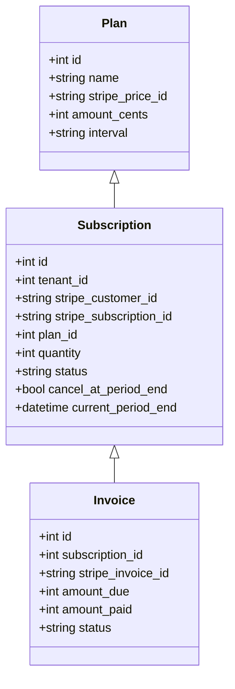
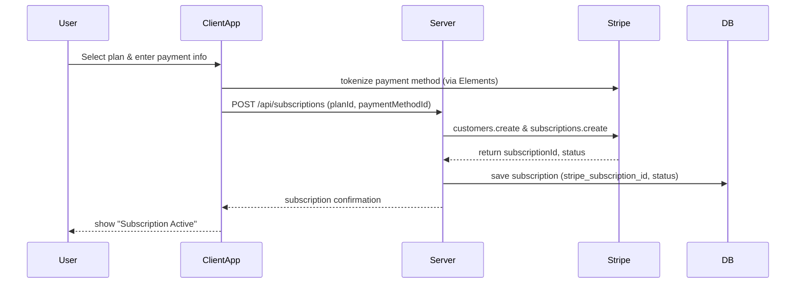
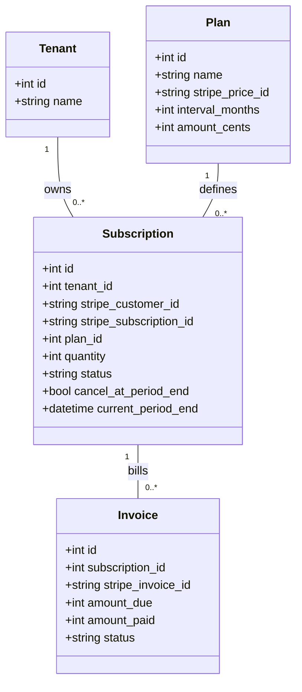

# Billing and Subscription Design for NutraTenant

## Executive Summary  
This document outlines a comprehensive design for adding a scalable billing and subscription system to the NutraTenant project. We recommend using Stripe as the payment processor, leveraging its Billing and Tax features to handle plans, metered usage, invoicing, tax calculation, dunning, receipts, and analytics. The design assumes NutraTenant is a multi-tenant SaaS app (likely Node.js/Express with PostgreSQL by convention) and adds database tables for subscription records, Stripe IDs, and related objects. Key flows (signup with plan selection, upgrades/downgrades with prorated charges, cancellations, trial conversion) are handled via Stripe’s Subscriptions API and webhooks. Security follows PCI DSS best practices by using Stripe Checkout/Elements so card data never touches our servers. Idempotency keys and webhook signature verification are used to ensure safe, repeatable operations. We include an implementation roadmap with migration steps (schema changes, Stripe setup, testing) and rollback strategies, plus a testing plan. Sample Node.js/Express endpoints and Mermaid diagrams (sequence and ER) illustrate the architecture. Throughout, we cite Stripe’s own documentation for pricing models, billing flows, webhooks, and PCI guidance to ensure alignment with best practices. 

## Current Repository Overview  
The NutraTenant repository appears to be a multi-tenant SaaS application (the name implies tenant-based data isolation). We do not have public source details, so we assume a typical tech stack (e.g. Node.js/Express or Ruby on Rails, using PostgreSQL, JWT or OAuth for auth) and a tenancy model such as a shared database with a `tenant_id` on tenant-specific tables. In a shared-DB multi-tenancy model, a common pattern is each table includes a `tenant_id` column so queries are scoped per tenant. Alternatively, NutraTenant could use a database-per-tenant approach, but for simplicity we assume a shared DB with a tenant foreign key. Authentication is likely user-centric (users belong to tenants) with role-based access. We will extend this model by linking each tenant (or account) to a Stripe Customer and Subscription record. *In absence of repo docs, specific component details are assumed for design purposes.*

## Subscription Models  
We support **multiple pricing models** to match different business needs:  
- **Free tier**: A $0 plan with limited features or usage. Implemented as a Stripe plan with price $0 or a free trial that never converts.  
- **Free trial**: Allowing new signups a limited-time trial (e.g. 7 or 14 days) before billing starts. Stripe supports free trials by including a 0 USD trial period in the subscription. After the trial, the subscription automatically transitions to the paid plan (see *Billing Flows* below).  
- **Flat-rate (tiered)**: Customers pick a tier (Basic, Pro, Enterprise) at a fixed monthly or yearly price. This is modeled in Stripe as one *price* per tier.  
- **Per-seat pricing**: Pricing based on number of user seats/licenses. Stripe can handle per-seat models by using a quantity on the subscription item, e.g. 10 seats at $X each. When adding/removing seats, update the quantity (see *Upgrade/Downgrade*).  
- **Usage-based (metered) pricing**: Charge customers based on usage (API calls, data, etc.). Stripe supports metered usage pricing models (fixed + overage, pay-as-you-go). In this case, you report usage (see *API Endpoints* and `Billing Meters`) and Stripe will invoice based on usage records.  

**Example Pricing Tiers:**  

| Tier        | Monthly Price (USD) | Features                    |
|------------|--------------------|-----------------------------|
| Basic      | 10.00              | 1 tenant, basic support      |
| Pro        | 25.00              | 5 tenants, email support     |
| Enterprise | 100.00             | Unlimited tenants, premium support |

*Pricing models* in Stripe (flat-rate, per-seat, tiered, usage-based) are documented in Stripe’s Recurring Pricing Models guide. Free trials and promotional rates can be configured using Stripe’s Trial Offer APIs.

## Billing Flows  
1. **Signup (Subscription Creation):** When a user signs up and chooses a plan, our backend creates a Stripe Customer and attaches a payment method (card or ACH) via Stripe.js/Elements. Then we call `stripe.subscriptions.create({ customer, items:[{price:chosenPriceId, quantity: seats}], trial_period_days: ... })`. For a free trial, include `trial_period_days` or a 0 USD price so the first invoice is $0. Stripe immediately generates and finalizes the first invoice (or schedules it). On success, we store the Stripe Customer ID and Subscription ID in our `subscriptions` table. The user is then marked as “active trial” or “active paid” depending on plan.  
2. **Trial Conversion:** If a trial is used, Stripe automatically ends the trial period and transitions the subscription to paid status on the specified date (no action needed). We should listen for `customer.subscription.trial_will_end` (sent ~3 days before trial end) to notify the user, and `customer.subscription.updated` when the status changes to `active` after trial to update our records. The subscription stays active and continues billing the regular price.  
3. **Upgrade/Downgrade (Change Plan):** To change a customer’s tier or seats mid-cycle, call `stripe.subscriptions.update` or update the specific subscription item. For example, to upgrade, set a higher-priced price ID on the item; to downgrade, set a lower-priced ID. By default Stripe **prorates** the change: it calculates a credit for unused time on the old plan and charges for the remainder at the new plan. We can preview the proration (`stripe.invoiceItem.preview`) or disable it by setting `proration_behavior="none"` if desired. After updating, Stripe generates an invoice for the prorated amount and charges the customer. Our API should also update our DB record to reflect the new plan and next billing date.  
4. **Cancellation:** To cancel, call `stripe.subscriptions.del(subscriptionId)`. By default this cancels immediately and no further invoices are generated. We should offer an option to “cancel at period end” (set `cancel_at_period_end=true`), which keeps the subscription active until the current term ends. Stripe will optionally generate a credit for the unused time (credit prorations) unless `proration_behavior=none`. After cancellation, we set the subscription status to `canceled` in our DB and revoke service. If the customer has a credit balance, Stripe can hold it for future or refund it.  
5. **Proration & Credits:** Stripe handles prorations automatically on mid-term changes (upgrades, downgrades, cancellations). Downgrades or cancellations before period end generate credit prorations (refunded as account credit or refund). Upgrades generate immediate charges. Our system can query or listen for the resulting invoice events to record the actual credit/refund and adjust user billing history.

## Payment Processing  
We recommend **Stripe Payments** for card and bank transactions. Stripe’s standard fee is **2.9% + 30¢** per successful card charge (plus 0.5% for manual entry, 1.5% for international cards). ACH Direct Debit is 0.8% capped at $5. These rates are competitive and transparent. Stripe Billing (subscriptions) adds an additional ~0.5% on recurring charges (pay-as-you-go plan) or offers volume pricing for high revenues. Other payment gateways (PayPal, Braintree) could be integrated if needed, but Stripe provides first-class subscription support. We use **Stripe Checkout or Elements** for collecting payment info: these securely tokenize card data so our servers never see raw card numbers (minimizing PCI scope). 3D Secure and SCA handling is built in. We will store only Stripe’s PaymentMethod IDs (not card details). All transactions use HTTPS; secrets (Stripe API keys) are kept in environment variables.

## Invoicing, Taxes, Receipts, Refunds  
Stripe automatically generates an **invoice** at each billing cycle for a subscription. The invoice is finalized (and paid) using the default payment method. Our system should handle `invoice.created`, `invoice.finalized`, and `invoice.paid` webhooks. Unpaid invoices enter a retry/dunning cycle (see next section). We can also create one-off or proration invoices via the API (e.g. billing out-of-cycle usage or fees).  

**Taxes:** We recommend enabling Stripe Tax for automated tax calculation and reporting. Stripe Tax can apply appropriate sales tax, VAT, and GST rates based on customer location. Alternatively, simple tax rates can be defined in Stripe and attached to plans or invoices. After each invoice, Stripe adds tax line items. Tax settings are configured per product/plan in Stripe.  

**Receipts:** Stripe automatically emails a **receipt** to the customer after each successful invoice payment. The receipt includes line items, discounts, and taxes. We can customize the branding in Stripe’s dashboard. Programmatically, the `charge` or `payment_intent` object includes a `receipt_url` if needed.  

**Refunds:** To refund, call Stripe’s Refund API on the charge or invoice. Stripe can auto-email a **refund receipt** if enabled. We should record refunds in our system and optionally credit the user’s account. 

## Failed Payments & Dunning  
When a payment fails (e.g. card declined), Stripe emits `invoice.payment_failed`. Our webhook handler should catch this, mark the invoice/subscription as `past_due` in DB, and notify the user to update payment info. Stripe provides **Smart Retries** and email templates to automatically re-attempt failed payments at optimal times. After 8 unsuccessful attempts (by default), Stripe will cancel the subscription. We should allow configuration of retry behavior and possibly implement our own grace period logic. Handling steps: 
- On first failure, send a friendly “payment failed” email. 
- Allow the user to retry or change card via a customer portal or our own UI. 
- If still unpaid after retries, mark the subscription canceled/expired. 
- Track this in metrics as churn. 
Stripe logs all retry attempts; we can rely on Stripe’s built-in dunning (Smart Retries and automated emails) to minimize manual effort.

## Webhooks and Reconciliation  
We will create a protected endpoint (e.g. `POST /webhooks/stripe`) to receive Stripe event webhooks. Important events to handle include:  

- **`customer.subscription.created/updated/deleted`** – When a subscription is created, changed, or canceled, update our `subscriptions` table (status, plan, current_period_end, etc).  
- **`invoice.created/finalized/paid/updated`** – Invoices let us track billing amounts. On `invoice.paid`, mark the payment in our system (e.g. activate features for that period). On `invoice.payment_failed`, handle as above.  
- **`invoice.payment_action_required`** – For failed SCA auth, prompt user.  
- **`invoice.upcoming`** – Sent a few days before renewal; could use to send email reminders or add usage line items.  
- **`charge.refunded` or `refund.updated`** – Update refund records.  
- **`payment_intent.succeeded/failed`** – Useful if using PaymentIntents directly.  
- **`customer.created`** – If using Stripe Connect or separate accounts, but likely not needed here.  

Use Stripe’s official libraries to parse the JSON and **verify the webhook signature** (via the `Stripe-Signature` header). This ensures the event is actually from Stripe. Always return 200 OK on success, 4xx on failure (no retries). To ensure idempotency, record each `event.id` we process so duplicate events (possible retries) are ignored.  

For **reconciliation**, we can periodically compare our records with Stripe’s. Stripe provides downloadable CSV reports and APIs: for example, we can list all subscriptions or invoices via `stripe.subscriptions.list()` and ensure our DB matches. Any orphaned subscriptions or unpaid invoices can be detected this way. For most cases, the webhook-driven updates keep us in sync; reconciliation jobs are a safety net and for financial auditing.  

## Reporting and Metrics  
Stripe Dashboard offers built-in analytics for recurring revenue: MRR, churn, LTV, etc.. We should monitor metrics like Monthly Recurring Revenue (MRR) and churn. Stripe even provides downloadable reports (CSV) for deeper analysis. Notably, reports include **MRR per subscriber**, **subscription metrics summary** (MRR roll-forward, trial conversion rates), and **customer MRR changes** (logs of upgrades, downgrades, churn). We can also filter by plan/price to see which tiers drive revenue. For our own database, we will record key dates (subscription start/end, cancellations) to compute metrics as needed. In addition, logs of each subscription event can feed a BI system (e.g. our own dashboards or tools like Baremetrics) if required. We should ensure we subtract discounts from MRR if we want conservative metrics, as Stripe allows configuration of how discounts are treated.

## Database Schema  
We will add tables to support subscriptions. Key tables include:  
- **`plans`** – Static list of plans or tiers our app offers, with fields: `id`, `name`, `stripe_price_id`, `interval` (month/year), `amount_cents`, feature flags. Index on `stripe_price_id`.  
- **`subscriptions`** – One per customer/tenant: `id`, `tenant_id`, `stripe_customer_id`, `stripe_subscription_id`, `plan_id`, `quantity` (seats), `status` (`active`,`trialing`,`past_due`,`canceled`), `current_period_end`, `cancel_at_period_end` (bool), timestamps. Index on `stripe_subscription_id`.  
- **`subscription_items`** – (if multiple items per sub) fields: `id`, `subscription_id`, `stripe_item_id`, `price_id`, `quantity`.  
- **`invoices`** – Store invoice records: `id`, `stripe_invoice_id`, `subscription_id`, `amount_due`, `amount_paid`, `status`, `billing_reason`, dates. Index on `stripe_invoice_id`.  
- **`payments`** – (Optional) record of successful payments: `id`, `stripe_charge_id`, `invoice_id`, `amount`, `paid_at`.  
- **`usage_records`** – For metered billing: `id`, `subscription_item_id`, `timestamp`, `quantity_reported`.  
- **`customers`** – If we allow multiple contacts, maybe a `customer` table to map our user to a Stripe customer.  
- Foreign keys: e.g. `subscriptions.plan_id -> plans.id`, `subscriptions.tenant_id -> tenants.id`.  
- Tenancy: All these tables include `tenant_id` if shared DB (except maybe `plans`).  

The ER diagram below (Mermaid class diagram) illustrates relationships:



Indexes: Primary keys on `id`; unique on Stripe IDs; foreign key indexes for `tenant_id` and `plan_id`. 

## API Endpoints  
We design RESTful endpoints for subscription management. Example paths (assuming Express/Node.js):  
- **POST `/api/signup`** – Creates a new user/tenant and optionally a subscription. Request includes plan ID and payment info. Backend creates Stripe Customer + Subscription.  
- **GET `/api/subscriptions/:id`** – Retrieves subscription status (active, trial end date, etc).  
- **POST `/api/subscriptions/:id/upgrade`** – Upgrade plan or increase seats. Body: new `plan_id` or `quantity`. Server calls Stripe to update subscription item (see code snippet).  
- **POST `/api/subscriptions/:id/downgrade`** – Downgrade plan. Similar to upgrade logic (call Stripe API with lower price).  
- **DELETE `/api/subscriptions/:id`** – Cancel subscription (optionally with query `?at_period_end=true`). Calls Stripe to cancel, updates status.  
- **POST `/api/payment-methods`** – Add or update a payment method on an existing Stripe Customer (using Stripe.js token or payment_method ID).  
- **GET `/api/invoices`** – List invoices for the authenticated tenant (retrieve from Stripe or DB).  
- **POST `/webhooks/stripe`** – Stripe webhook receiver (see next section).  

*Example Node.js snippet (Express)*:

```js
const stripe = require('stripe')(process.env.STRIPE_SECRET_KEY);
app.post('/api/subscriptions', async (req, res) => {
  const { planId, paymentMethodId } = req.body;
  const plan = await db.findPlan(planId);
  const customer = await stripe.customers.create({ email: req.user.email });
  // Attach payment method
  await stripe.paymentMethods.attach(paymentMethodId, { customer: customer.id });
  await stripe.customers.update(customer.id, { invoice_settings: { default_payment_method: paymentMethodId } });
  // Create subscription
  const subscription = await stripe.subscriptions.create({
    customer: customer.id,
    items: [{ price: plan.stripe_price_id }],
    expand: ['latest_invoice.payment_intent']
  });
  // Store in DB
  await db.createSubscription(req.user.tenantId, customer.id, subscription.id, planId);
  res.json({ subscriptionId: subscription.id, status: subscription.status });
});
```

Each endpoint should validate input, handle Stripe errors, and use **idempotency keys** for POST calls to avoid duplicates.  

## Background Jobs & Scheduling  
Certain tasks run in the background or on a schedule:  
- **Daily Jobs:**  
  - **Usage aggregation:** For metered billing, if we’re collecting usage on-the-fly, we might summarize or report usage daily. Stripe’s Meters API can be used to send usage records as they occur; a daily job could verify all usage is reported.  
  - **Failed payment reviews:** Query `stripe.subscriptions.list({status: 'past_due'})` and email those customers or retry manually if needed.  
  - **Subscription cleanup:** Remove expired/trial-only accounts after a grace period.  
- **Weekly/Monthly Jobs:**  
  - **Revenue reconciliation:** Export Stripe transactions vs. accounting system.  
  - **Email reminders:** If desired, send renewal reminders or receipts (though Stripe can email receipts automatically).  
- **Cron Schedules:** e.g. at midnight, trigger reminders for `invoice.upcoming` events (though Stripe can send automatic reminder emails).  

We also use **async jobs** for tasks like sending confirmation emails or processing webhooks to avoid blocking the web response. 

## Webhook Handlers  
Our `/webhooks/stripe` endpoint will route events by type. Pseudocode for a handler:

```js
app.post('/webhooks/stripe', express.raw({type: 'application/json'}), (req, res) => {
  const sig = req.headers['stripe-signature'];
  let event;
  try {
    event = stripe.webhooks.constructEvent(req.body, sig, endpointSecret);
  } catch (err) {
    return res.status(400).send(`Webhook error: ${err.message}`);
  }
  // Idempotency: check if event.id processed
  if (db.eventProcessed(event.id)) {
    return res.sendStatus(200);
  }
  switch (event.type) {
    case 'customer.subscription.created':
    case 'customer.subscription.updated':
      // Update subscription record in DB
      handleSubscriptionUpdated(event.data.object);
      break;
    case 'customer.subscription.deleted':
      // Mark subscription canceled
      handleSubscriptionDeleted(event.data.object);
      break;
    case 'invoice.payment_succeeded':
      handleInvoicePaid(event.data.object);
      break;
    case 'invoice.payment_failed':
      handleInvoiceFailed(event.data.object);
      break;
    // ... handle other events as needed ...
    default:
      // Ignore other events
  }
  db.markEventProcessed(event.id);
  res.sendStatus(200);
});
```

Each handler extracts relevant fields (e.g. `subscription.id`, `status`, `current_period_end`, etc) from `event.data.object` and updates our DB. We **must verify** the webhook signature to prevent spoofing. We also use idempotency in processing (store processed event IDs) so retries don’t double-process.  

## Security Considerations  
- **PCI DSS Compliance:** We never handle raw card data on our server. By using Stripe Checkout or Elements, sensitive data is sent straight to Stripe’s PCI-validated servers (SAQ-A compliance). We do not store CVV or PAN.  
- **API Keys & Secrets:** Stripe secret keys live only in secure env vars or a secrets store. They are not hardcoded or exposed in logs. We also use the endpoint’s webhook signing secret (from Stripe Dashboard) to verify signatures.  
- **Webhook Signature Verification:** We use Stripe’s libraries to verify the `Stripe-Signature` header on each event. Any mismatch or parsing failure returns 400.  
- **Idempotency:** For all create operations (charges, subscriptions), use Stripe’s `Idempotency-Key` header with a unique value (e.g. a UUID tied to the operation). If a request times out and is retried, Stripe guarantees it will only be executed once. This avoids double-charging.  
- **Access Control:** Only authenticated users can call billing endpoints. We enforce tenant scoping in our middleware. Webhook endpoint uses a secret header, not public access.  
- **Encryption:** Sensitive user info (emails, etc) is stored with encryption at rest by our database (standard best practice).  
- **Logging/Auditing:** Log Stripe request IDs and idempotency keys for traceability. Do not log full payment details.  
- **Least Privilege:** The Stripe secret key should have only the permissions needed (no extra). Our DB user has minimal rights for billing tables.

## Migration Plan  
1. **Schema Migration:** Apply DB migrations to add new tables (`subscriptions`, `plans`, etc). Keep this backward compatible (apps not yet using them should ignore).  
2. **Stripe Setup:** In Stripe Dashboard (test mode), create Products and Prices for each plan/tier. Set up Tax and Email templates. Configure a webhook endpoint URL (pointing to our dev server).  
3. **Feature Development & Testing:** Develop the new endpoints and webhook handler in a feature branch. In test mode, simulate full flows (create subscription, upgrade, payment failure, etc.). Use Stripe’s CLI or dashboard to fire events.  
4. **Seed Data:** Insert existing plan/pricing data into `plans` table with the Stripe price IDs.  
5. **Staging Rollout:** Deploy to a staging environment. Run integration tests end-to-end with Stripe’s test keys. Verify logs, DB updates, and email notifications.  
6. **Gradual Launch:** Switch feature flag or configuration to enable billing. For an existing userbase, we may grandfather existing customers (e.g. manually create Stripe subscriptions for them), or if no customers exist, just start anew.  
7. **Monitor:** After going live, monitor logs for webhook errors, failed payments, and billing issues. Check that metrics (MRR) look correct.  
8. **Rollback Plan:** If issues arise, disable the new billing features, revert code, and run the down-migration (dropping tables or columns) if safe. Since the old app had no billing, rollback means removing billing-related code.  

## Testing Strategy  
- **Unit Tests:** Mock Stripe’s Node library to test our business logic (e.g. computing proration, updating statuses). Test invalid inputs and error paths.  
- **Integration Tests:** Use Stripe’s test mode to create real API calls in a test environment. Tools like [stripe-mock](https://github.com/stripe/stripe-mock) can simulate Stripe responses offline. Cover flows: new subscription, upgrade, fail payment, cancel.  
- **Webhook Tests:** Use the Stripe CLI (`stripe listen`) to send test webhook events to our endpoint and assert DB changes.  
- **Security Tests:** Verify that webhooks with wrong signatures are rejected. Use a tool to scan for common PCI issues (though using Stripe heavily reduces scope).  
- **Load Testing:** Simulate many subscription creations and API calls to ensure the system can scale (especially the webhook queue processing).  
- **End-to-End QA:** As a final check, simulate user behavior in a QA environment, including email receipts, invoices, and manual interventions.  

## Cost and Scalability  
- **Stripe Fees:** As noted, card transactions are 2.9% + $0.30 (plus 0.5% manual, 1.5% international). For example, at $50K MRR with monthly billing, Stripe’s fees would be ~$17,400/year (assuming US cards). ACH is cheaper (0.8% up to $5). The Stripe Billing product adds ~0.5% on top of recurring charges. We should include these in our pricing strategy.  
- **Growth:** The system’s architecture is horizontally scalable. Each subscription transaction involves a few Stripe API calls; Stripe’s platform can handle very high volume. Our primary scalability concerns are database growth and webhook throughput. We should index on tenant and subscription IDs to keep lookups fast. If the number of tenants grows extremely large, consider strategies from multi-tenant design (sharding by tenant, etc).  
- **Resource Usage:** Background jobs (e.g. daily reconciliation) can run on a scheduled worker. Ensure message queues can handle bursts of webhooks (Stripe can send hundreds concurrently). Use caching (e.g. of plan info) to reduce DB load.  
- **Third-party costs:** Stripe transactions and add-on fees are the main costs. Hosting costs will scale with user base (more users = more web traffic and emails).  

## Diagrams  

**Sequence Diagram – Subscription Signup Flow:** Illustrates a user subscribing through our system and Stripe.  


**ER Diagram – Billing Tables:** Shows key entities and relationships.  


## Subscription Tier Comparison  

| Tier        | Price (USD/month) | Description                                 |
|------------|------------------|---------------------------------------------|
| Free       | 0.00             | Limited features, max 1 tenant (no support) |
| Starter    | 15.00            | Up to 5 tenants, email support              |
| Professional | 50.00          | Up to 20 tenants, priority support          |
| Enterprise | Custom           | Unlimited tenants, dedicated support        |

## Key Stripe Events and Webhook Data  

| Event                      | Description                          | Relevant Payload Fields                                |
|----------------------------|--------------------------------------|--------------------------------------------------------|
| `customer.subscription.created` | New subscription created          | `id` (subscription ID), `status`, `current_period_end` |
| `customer.subscription.updated` | Subscription changed (plan/qty)  | `items`, `plan`, `quantity`, `status`, `cancel_at_period_end` |
| `customer.subscription.deleted` | Subscription canceled            | `id`, `canceled_at`, `status`                          |
| `invoice.payment_succeeded`      | Invoice was paid                | `id` (invoice), `amount_paid`, `stripe_subscription_id` |
| `invoice.payment_failed`         | Payment failed (e.g. card declined) | `id` (invoice), `attempted`, `next_payment_attempt`   |
| `invoice.upcoming`               | Upcoming renewal (reminder)     | `id` (invoice), `upcoming`, `period_end`               |
| `charge.refunded`                | A charge was refunded          | `charge.id`, `amount_refunded`, `refunds` array        |
| `payment_intent.succeeded`       | PaymentIntent succeeded       | `id` (payment_intent), `charges.data` (charge info)    |

These webhook events are handled to keep our DB in sync. For example, on `invoice.payment_succeeded` we mark the subscription as paid and provision service; on `invoice.payment_failed` we flag the subscription as unpaid and notify the customer.

Each webhook payload contains nested data. We typically extract the IDs and amounts needed (e.g. `event.data.object.id`, `event.data.object.status`).

---

**Sources:** Stripe Billing and API documentation and guides (for pricing). Also Microsoft’s Azure multi-tenant patterns.
